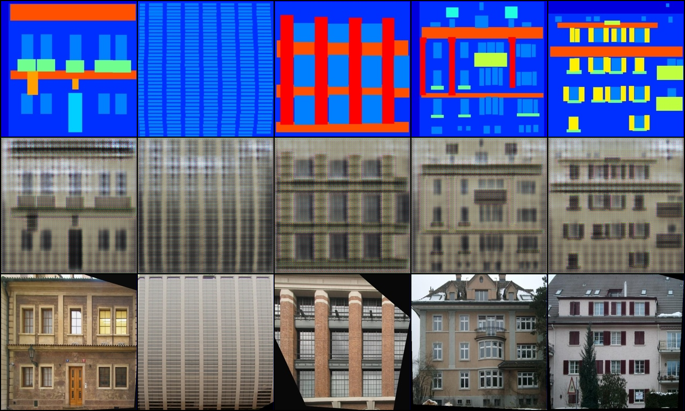
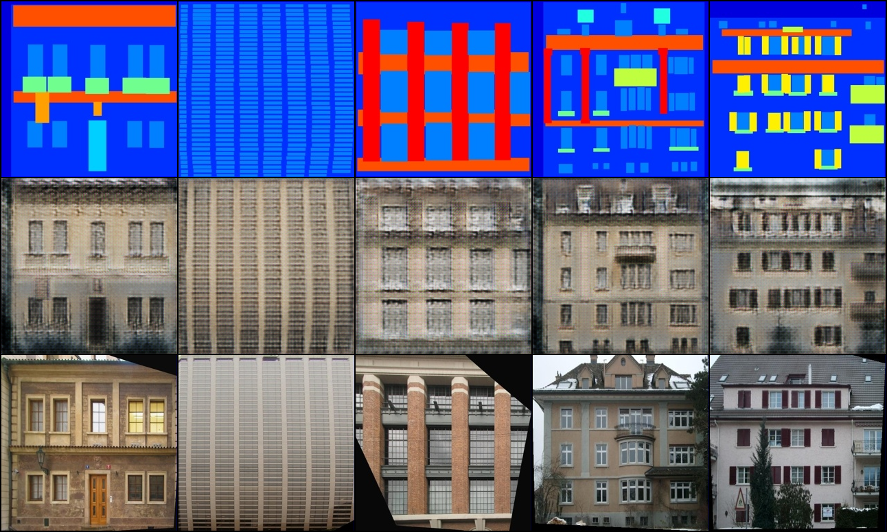
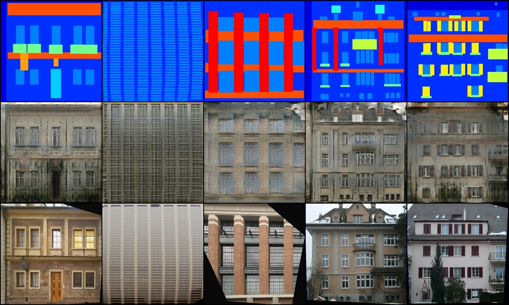
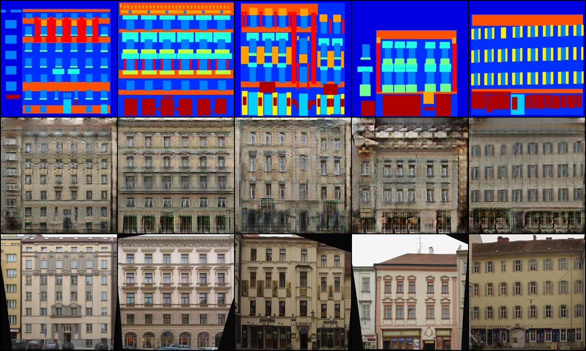
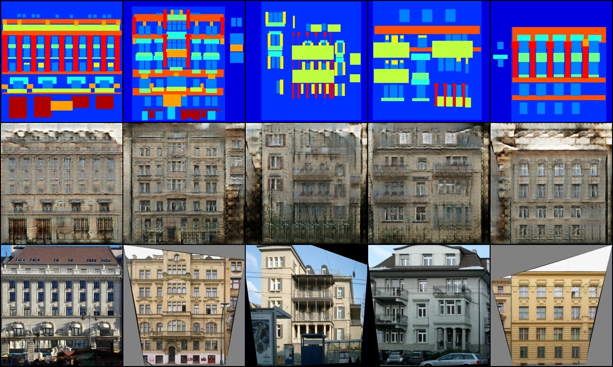

# PRODIGY_GA_04 — Image-to-Image Translation with cGAN (pix2pix)

## Task
Implement an image-to-image translation model using a conditional generative
adversarial network (cGAN) called pix2pix.

## Approach
This project implements the **pix2pix architecture from scratch in PyTorch**
(Isola et al., 2017 — *Image-to-Image Translation with Conditional Adversarial
Networks*), rather than using a pre-built implementation, since the task is
about understanding how the conditional adversarial setup actually works.

The model is trained on the classic **CMP Facades** dataset (400 paired
images, downloaded automatically): the input is an architectural **label map**
and the model learns to translate it into a photorealistic **building facade**.

Three components were built:

1. **U-Net generator** — an 8-level encoder-decoder with skip connections
   (54M parameters), so low-level structure in the label map can flow
   directly to the corresponding decoder layer instead of being squeezed
   through the 1×1 bottleneck.
2. **70×70 PatchGAN discriminator** — instead of judging the whole image
   with one real/fake score, it outputs a 30×30 grid of scores, each judging
   one 70×70 patch. This pushes the generator toward sharp local texture.
3. **The pix2pix training objective** — the discriminator sees the *(input,
   output)* pair (this is what makes the GAN *conditional*), and the
   generator is trained with adversarial loss **+ λ·L1 loss (λ = 100)**
   against the ground truth.

## How pix2pix Works (Concept Summary)
A plain GAN generates images from random noise; a **conditional** GAN
generates them from an *input image*, and the discriminator judges whether an
(input, output) pair looks real — so the generator can't just produce any
plausible facade, it must produce the facade *for that specific label map*.
The **L1 loss** anchors outputs to the ground truth (correct colors and
global structure) but on its own produces blurry averages; the **adversarial
loss** supplies the sharp, high-frequency detail L1 can't. The two losses are
complementary, which is the core insight of the paper.

This completes a tour of three generative paradigms across these tasks:
autoregressive next-token prediction ([`PRODIGY_GA_01`](../PRODIGY_GA_01)),
iterative denoising ([`PRODIGY_GA_02`](../PRODIGY_GA_02)), and now
**adversarial training** — two networks improving by competing, with no
explicit likelihood being modelled at all.

## Results
Each saved image is a grid of three rows: **input label map** (top),
**generated facade** (middle), **ground truth** (bottom).

### Training Progression
Samples on a fixed validation batch are saved at epoch 1 and every 10th
epoch to `outputs/progress/epoch_XXX.png` — early epochs produce blurry
color blobs, and window/balcony texture sharpens as the adversarial loss
kicks in.

| Epoch 1 | Epoch 20 | Epoch 50 |
|---|---|---|
|  |  |  |

### Held-Out Test Results
Final translations on unseen test facades: `outputs/test_results/`




The trained generator weights are saved to `outputs/generator.pth`.

## How to Run
```bash
pip install -r requirements.txt
python train.py
```
Downloads the facades dataset, trains for 50 epochs (≈40 min on a Colab T4
GPU), saves progression grids to `outputs/progress/`, test grids to
`outputs/test_results/`, the generator checkpoint to
`outputs/generator.pth`, and bundles everything into `pix2pix_outputs.zip`.

Or open `PRODIGY_GA_04.ipynb` in Google Colab (**Runtime → Change runtime
type → T4 GPU**) and run all cells — the zip auto-downloads when it finishes.

## What I Learned
Implementing both networks from scratch made the adversarial dynamic
concrete: the discriminator and generator are locked in a minimax game, and
neither loss curve "converges" the way a supervised loss does — balance
matters more than absolute values. The most instructive design choices were
the ones that seem small but are load-bearing: skip connections (without
them the label map's structure is lost in the bottleneck and outputs turn to
mush), conditioning the discriminator on the input (otherwise it can't
punish outputs that ignore the label map), and the λ = 100 L1 term (without
it training is unstable and outputs drift from the ground truth). Compared
to GA_02, this task showed the other side of generative imaging — actually
*training* a generative model versus running inference on a pre-trained one.

## Tech Stack
- Python, PyTorch, torchvision
- CMP Facades dataset (via the Berkeley pix2pix dataset server)
- Google Colab (T4 GPU)
